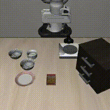
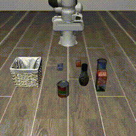
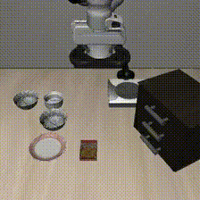
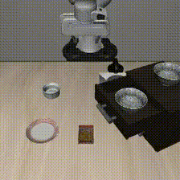
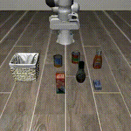
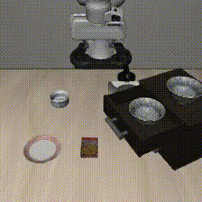

# Vision-Language-Action Models for Embodied AI

This repository contains research on improving generalization in robotic manipulation through vision-language-action (VLA) models. The work focuses on replicating state-of-the-art results with OpenVLA and implementing inference-time improvements inspired by LITEN (Learning from Inference-Time Execution).

## Demo imgs

### Successful Executions

<table>
<tr>
<td width="33%">
</img>
<p align="center"><em>Pick up bowl between plate and ramekin</em></p>
</td>
<td width="33%">
</img>
<p align="center"><em>Pick up alphabet soup and place in basket</em></p>
</td>
<td width="33%">
</img>
<p align="center"><em>LITEN: Successful execution with retries</em></p>
</td>
</tr>
</table>

### Failed Executions

<table>
<tr>
<td width="33%">
</img>
<p align="center"><em>Drawer manipulation failure</em></p>
</td>
<td width="33%">
</img>
<p align="center"><em>Salad dressing placement failure</em></p>
</td>
<td width="33%">
</img>
<p align="center"><em>LITEN: Failed after 3 retry attempts</em></p>
</td>
</tr>
</table>

## Overview

This project addresses the fundamental challenge of cross-task generalization in embodied artificial intelligence. Traditional robot learning approaches require task-specific training for every new scenario, making them impractical for real-world deployment. This work demonstrates how VLA models pretrained on internet-scale data can develop manipulation skills that transfer across different spatial configurations and object categories.

## Research Problem

The generalization problem in embodied AI manifests across multiple dimensions:

- **Object variation**: Different shapes, sizes, colors, and materials
- **Spatial variation**: Novel configurations and placement locations
- **Task variation**: New instruction phrasings and goal specifications
- **Environmental variation**: Different backgrounds, lighting, and contexts

This investigation specifically focuses on cross-task generalization within robotic manipulation using the LIBERO benchmark suite.

## Methodology

### State-of-the-Art Model: OpenVLA

OpenVLA is a 7-billion parameter vision-language-action model that extends pretrained vision-language backbones to output robot actions. Key architectural components:

**Dual Vision Encoders:**

- **SigLIP**: Trained on 400M image-text pairs for semantic understanding
- **DINOv2**: Self-supervised encoder for spatial precision

**Language-Conditioned Transformer:**

- Llama-2-based backbone processes visual features with natural language instructions
- Enables understanding of complex manipulation commands

**Action Tokenization:**

- Discretizes 7-DoF robot actions into 256 bins per dimension
- Leverages transformer's sequence modeling for action generation

OpenVLA was trained on the Open X-Embodiment dataset (970,000 demonstrations from 22 robot types covering 527 skills) and achieves 16.5% improvement over Google's RT-2-X while using 7B vs. 55B parameters.

### Inference-Time Improvements: LITEN

After replicating OpenVLA, we implemented inference-time techniques inspired by LITEN (Learning from Inference-Time Execution). The key innovation is hierarchical decomposition:

- **High-level reasoning**: Assesses task execution and failure modes
- **Low-level execution**: OpenVLA performs manipulation actions
- **Iterative refinement**: Failed attempts inform subsequent retries

This approach enables recovery from transient failures without requiring model retraining.

## Experimental Setup

**Compute Platform:** Google Colab with A100 GPU

**Budget:** Approximately $20 in compute credits

**Evaluation Scope:** 5 episodes per task (reduced from 50 in original paper)

**Benchmark Suites:**

- `libero_spatial`: Tests generalization to novel spatial configurations
- `libero_object`: Tests generalization to different object categories

## Results

### Baseline OpenVLA Performance

| Task Suite     | Success Rate | Episodes  |
| -------------- | ------------ | --------- |
| libero_spatial | 68.0%        | 17/25     |
| libero_object  | 68.0%        | 17/25     |
| **Average**    | **68.0%**    | **34/50** |

### LITEN with Retry Mechanism

| Task Suite     | Baseline  | LITEN     | Improvement |
| -------------- | --------- | --------- | ----------- |
| libero_spatial | 68.0%     | 96.0%     | +28.0%      |
| libero_object  | 68.0%     | 76.0%     | +8.0%       |
| **Average**    | **68.0%** | **86.0%** | **+18.0%**  |

### Key Statistics

- **Average retries per episode**: 0.28 (spatial), 0.48 (object)
- **Most retries needed**: 3 attempts for drawer manipulation task
- **First-attempt success rate**: 72% (spatial), 60% (object)
- **Second-attempt recovery rate**: 83% of failures

## Repository Structure

```
.
├── context/
│   ├── assignment.md              # Assignment description
│   ├── Fundamentals.md            # Background on embodied AI
│   ├── Liten_impl.md              # LITEN implementation notes
│   ├── LITEN_Technical_Report.md  # Detailed technical documentation
│   └── proposed_ideas.md          # Brainstorming and candidate approaches
├── results/
│   ├── baseline-eval/
│   │   ├── baseline-eval.ipynb    # Initial OpenVLA evaluation
│   │   └── EVAL-libero_spatial-*.txt
│   ├── full-replication/
│   │   ├── full-replication.ipynb # Complete reimplementation
│   │   ├── logs/                  # Evaluation logs
│   │   └── rollouts/              # Video recordings
│   └── liten-impl/
│       ├── liten-impl.ipynb       # LITEN implementation
│       ├── LITEN-libero_spatial-*.txt
│       └── rollouts/              # Video recordings with retries
├── report.tex                      # Full technical report (LaTeX)
└── README.md                       # This file
```

## Key Findings

1. **Reproducibility**: Successfully replicated OpenVLA's performance within resource constraints, achieving 68% success rate on both spatial and object generalization tasks.

2. **Inference-time improvements work**: Simple retry mechanisms improved performance by 18% on average without any model retraining, demonstrating the viability of inference-time learning.

3. **Spatial vs. object generalization**: LITEN showed stronger improvements on spatial tasks (+28%) compared to object tasks (+8%), suggesting different failure modes benefit differently from retry strategies.

4. **Failure recovery**: 83% of initial failures were recovered on second attempt, indicating many failures are transient rather than fundamental capability gaps.

## Implementation Details

### Baseline Evaluation

The baseline evaluation loads pretrained OpenVLA checkpoints and runs them on LIBERO tasks:

- Image preprocessing: center crop + resize to 224x224
- Action unnormalization using task-specific statistics
- Episode termination via task success signals and timeout conditions

### LITEN Implementation

A simplified LITEN implementation capturing core retry mechanisms:

```python
MAX_RETRIES = 3

while not success and attempt < MAX_RETRIES:
    attempt += 1
    success, steps, failure_mode = run_episode(
        env, model, task, initial_state, attempt
    )
```

Failure mode assessment based on execution progress:

- Early failure (< 20% progress): grasp/targeting issues
- Mid failure (20-50%): manipulation problems
- Late failure (50-80%): placement difficulties
- Timeout (> 80%): nearly completed

## Limitations and Future Work

**Current Limitations:**

- Reduced evaluation scale (5 vs. 50 episodes per task)
- Simplified LITEN without full VLM-based reasoning
- Rule-based affordance hints instead of GPT-4V/Claude analysis

**Future Directions:**

- Integrate external VLM for video-based failure analysis
- Implement action trajectory smoothing (temporal ensembling)
- Explore real-time chunking for eliminating prediction discontinuities
- Test on additional LIBERO suites (libero_goal, libero_100)

## References

**Key Papers:**

- Kim, M. J., et al. (2024). OpenVLA: An Open-Source Vision-Language-Action Model. arXiv:2406.09246

- Shah, D., et al. (2024). Learning Affordances at Inference-Time for Vision-Language-Action Models. arXiv:2510.19752

- Liu, B., et al. (2023). LIBERO: Benchmarking Knowledge Transfer for Lifelong Robot Learning. NeurIPS

- Brohan, A., et al. (2023). RT-2: Vision-Language-Action Models Transfer Web Knowledge to Robotic Control. CoRL

- Open X-Embodiment Collaboration (2024). Open X-Embodiment: Robotic Learning Datasets and RT-X Models. ICRA

## Acknowledgments

This work was completed as a PhD application assignment. All experiments were conducted using Google Colab with A100 GPU access, totaling approximately $20 in compute costs.

AI tools (Claude, GitHub Copilot) were used to assist with code generation, debugging, documentation, and research exploration. All core ideas, implementations, and analyses were developed independently.

## License

This is academic research code. Please refer to the original OpenVLA and LIBERO repositories for their respective licenses.
